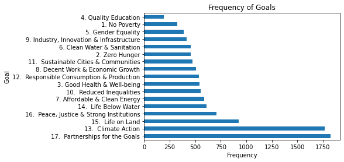
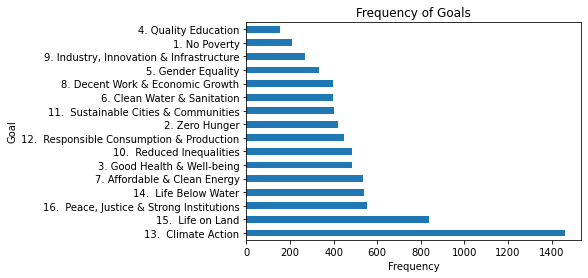
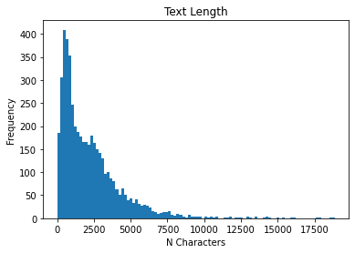
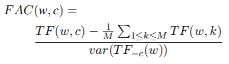
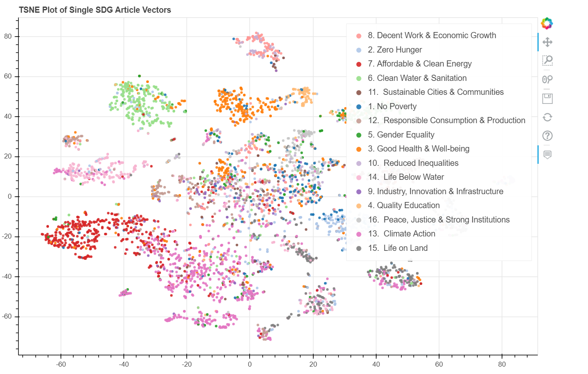

# SDG-ACE-2020
A Team project by Zhengyang Jin, Jason Verrall, Hayden Banes and Jaspal Panesar

Code link: [Here](SDGs.ipynb)

## 1. Competition Introduction  
The Sustainable Development Goals (SDGs) are a collection of 17 global goals designed to be a "blueprint to achieve a better and more sustainable future for all".
The SDGs, set in 2015 by the United Nations General Assembly and intended to be achieved by the year 2030, are part of UN Resolution 70/1, the 2030 Agenda.

The Sustainable Development Goals are:  
1.No Poverty  
2.Zero Hunger  
3.Good Health and Well-being    
4.Quality Education    
5.Gender Equality  
6.Clean Water and Sanitation  
7.Affordable and Clean Energy  
8.Decent Work and Economic Growth  
9.Industry, Innovation, and Infrastructure  
10.Reducing Inequality  
11.Sustainable Cities and Communities  
12.Responsible Consumption and Production  
13.Climate Action  
14.Life Below Water  
15.Life On Land  
16.Peace, Justice, and Strong Institutions  
17.Partnerships for the Goals  
  
<br>
The goals are broad based and interdependent. The 17 sustainable development goals each has a list of targets which are measured with indicators.
In an effort to make the SDGs successful, data on the 17 goals has been made available in an easily-understood form. A variety of tools exist to track and visualize progress towards the goals.  


<br>
<br>
Our task is to use existing resources to create a project to contribute to the SDG program.  
Here, we use natural language processing technology to classify and cluster some data to reduce the workload of experts.

## 2. Resource 

### Official Resource
2018_WoS.csv  
This is a table contain publication code, journal name , topic , abstract of paper.

Columns:
0: Publication code. A unique code that identifies the publication.
1: Journal name.
2: Title.
3: Abstract.

### Extended Resources  
We use Scrapy got some data from the SDG databases. We also created a journal discovery tool to search for suitable articles. This maintains the balance of the training data very well, which makes our model more robust.
So these data are labeled. We can use them for supervised learning. But this is not only our only method, we also think about directly using the provided data for unsupervised learning. Details will be introduced in "methods".

## 3. Methods  
#### Supervised learning  
One is to use the labeled data of the extended data set for supervised learning.
We tried  KNeighborsClassifier and SVD techniques.For details, please click: [Here (Supervised learning)](#jump1)


#### Unsupervised learning
Other one is use expert knowledge and word embedding for unsupervised text classification.This method is inspired by an ACL 2019 paper, [《Towards Unsupervised Text Classification Leveraging Experts and Word Embeddings》](https://www.aclweb.org/anthology/P19-1036/)
For details, please click: [Here (Unsupervised learning)](#jump2)

### <span id="jump1">3.1 Supervised learning</span>

#### 3.1.1 Test data Preprocessing
After testing, we found that in the data of 2018_WoS.csv, there are a lot of defective data. Among them, there are a total of 1,630,350 pieces of data, and 34,492 pieces of data lack abstract.
Therefore, we are faced with two choices, one is to divide the data into two data sets for separate classification, and the other is to fill in the default values. According to [LaFleur, M. (2019)](https://www.un.org/development/desa/publications/working-paper/wp159)
research, we decided to use the article title as an alternative to the default value. 
And we counted the number of journals, there are 12,912 journals in total.The number is too large and will seriously affect the classification accuracy. So we give up categorizing articles by journal name.  




#### 3.1.2 Train Data cleaning
Since the data crawled by the spider is not balanced, we need to further process the data.
We exclude data that is particularly large and small.
At the same time, it is considered that SDG is a goal that has only been produced in recent years.
Therefore, without affecting the distribution of categories, we exclude papers that are particularly old. Finally, we appropriately reduced the data on topics with too many papers.
<br><br>
Then Tokenise each document at the word level. Remove punctuation. Remove stop words, such as the, and, to etc. Apply lower case to all tokens.  
```
    Example for tokenise
    Original text of first document:
    This chapter examines the growth of solar photovoltaic (PV) power across regions and countries, from the early 2000s until the current period. It will identify the countries where the initial solar PV development began and the countries where development is currently growing. The chapter will also assess the likely future path of solar PV in the coming years and offer some predictions as to how and where future growth will take place. This will entail an analysis of the drivers of deployment in the past, present, and future. Finally, the chapter will examine the breakdown of the types of deployment by segment, offering views on their future development. 
    
    First 10 tokens in first document 0:
    ['chapter', 'examines', 'growth', 'solar', 'photovoltaic', 'power', 'across', 'regions', 'countries', 'early']
```    

Then use lemmatization to try to extract the root of most words.

```
    Example for lemmatization
    First 10 tokens in first document 0:
    ['chapter', 'examines', 'growth', 'solar', 'photovoltaic', 'power', 'across', 'regions', 'countries', 'early'] 
    
    First 10 lemmas in first document 0:
    ['chapter', 'examines', 'growth', 'solar', 'photovoltaic', 'power', 'across', 'region', 'country', 'early']
```

Then count up all of the tokens in our processed corpus and found which are the most common. Then we delete some useless common words, such as "development", "country", "report", "also".
```
    Example for Term Frequencies
    [('development', 8692),
     ('climate', 7137),
     ('country', 6517),
     ('sustainable', 6453),
     ('report', 5649),
     ('global', 5527),
     ('energy', 5103),
     ('change', 4788),
     ('also', 4536),
     ('international', 4311),
     ('action', 4056),
     ('world', 3977),
     ('water', 3960),
     ('sdg', 3568),
     ('meeting', 3452),
     ('policy', 3240),
     ('including', 3191),
     ('support', 3125),
     ('implementation', 2963),
     ('national', 2827),
     ('new', 2826),
     ('conference', 2824),
```

Tf-idf
by weighting the count of each word in a document with the inverse of its frequency across all documents. We can weaken high-frequency words and strengthen low-frequency words, so that the words produce a quantitative score.
```
    Score Term
    0.399 chapter
    0.363 solar
    0.310 future
    0.275 deployment
    0.194 breakdown
    0.188 entail
    0.179 prediction
    0.175 growth
    0.159 photovoltaic
    0.157 offering
```


#### 3.1.3 Apply classification model

We decided to conduct multi-class training so that the model has more classification capabilities.
We try to convert the file into a binary matrix and directly use the KNNclassifier in sklearn as the training model.
Split the data set into 20% test data and 80% training data. The final test results are as follows:
```
                                               precision    recall  f1-score   support
    
                                1. No Poverty       0.44      0.18      0.26        38
                               2. Zero Hunger       0.87      0.54      0.67       100
                  3. Good Health & Well-being       0.88      0.53      0.66       106
                         4. Quality Education       0.88      0.42      0.57        36
                           5. Gender Equality       0.84      0.36      0.51        58
                  6. Clean Water & Sanitation       0.93      0.74      0.82        69
                 7. Affordable & Clean Energy       0.83      0.73      0.78       115
             8. Decent Work & Economic Growth       0.69      0.38      0.49        76
     9. Industry, Innovation & Infrastructure       0.80      0.23      0.36        52
                    10.  Reduced Inequalities       0.84      0.59      0.69       104
        11.  Sustainable Cities & Communities       0.89      0.46      0.61        67
    12.  Responsible Consumption & Production       0.88      0.52      0.66       115
                          13.  Climate Action       0.86      0.78      0.82       295
                        14.  Life Below Water       0.85      0.80      0.82        98
                            15.  Life on Land       0.89      0.80      0.84       150
    16.  Peace, Justice & Strong Institutions       0.69      0.68      0.68       111
    
                                    micro avg       0.84      0.62      0.71      1590
                                    macro avg       0.82      0.55      0.64      1590
                                 weighted avg       0.83      0.62      0.70      1590
                                  samples avg       0.81      0.70      0.72      1590
```
The result was lower than our expectations, and even under some themes, it was very bad. We think about using classification training to optimize model performance.
In this case, our model will be individually trained for each SDG. Therefore, we also adjusted the parameters separately and used Singular Value Decomposition (SVD) to create dense vectors. 
Result seems better:
```
    7. Affordable & Clean Energy
                       pre       rec       spe        f1       geo       iba       sup
    
              0       0.98      0.99      0.82      0.98      0.90      0.82       819
              1       0.91      0.82      0.99      0.86      0.90      0.79       109
    
    avg / total       0.97      0.97      0.84      0.97      0.90      0.82       928
    
```
Then we can use this classifier for classification.

### <span id="jump2">3.2 Unsupervised learning</span>
Consider that in many cases, the cost of manually labeling data is often very large. We need some unsupervised or semi-supervised ways to solve the problem, which can save a lot of resources for other tasks.
The main ideas are:  

1. Clean the document d to generate a vector V(d*) representing the document;  

2. The text category L is cleaned, expanded, and filtered to generate the corresponding category lexicon, and the lexicon is used to generate the vector V(L*) representing the category L;  

3. Finally, similarity(V(d*),V(L*)), which category L has the highest similarity between the text, belongs to this category.  


#### 3.2.1 Data Cleaning
It is basically similar to the previous preprocessing method.

####  3.2.2 Enrichment
This step is carried out for label, and its main purpose is to expand the category thesaurus through four specific methods, specifically:  

1. Use experts or search engines to provide 3-5 representative words for each category;  

2. Use WordNet to add synonyms and synonyms corresponding to the word found in the previous step into the thesaurus;  

3. Use the existing category thesaurus to find the representative documents of each category (threshold 70%), and add the words in the document to the category thesaurus;  

4. Using Word Embedding, find some similar words to add to the thesaurus;  

PS: The words found in each step must have appeared in the document;  


#### 3.2.3 Consolidation
Consolidation refers to filtering out some non-obvious words in the category thesaurus found in the enrichment step, and leaving high-quality words. The filtering standard is judged by the following formula:

  

TF(w,c) is the frequency of word w in category c, the right side of the numerator is the average frequency of word w in all categories, and the denominator represents the variance of word w in the category other than c. When FAC(w,c) is lower than a certain threshold, the word w is deleted from the category.


#### 3.2.4 similarity
The last step is to calculate the cosine similarity between document d and category l. In vectorization, the LSA method is used to perform singular value decomposition using word-document and word-label matrices to generate their respective latent semantic spaces. Then use the respective generated vectors for cosine similarity calculation

## Result
Detiled result [Here](https://github.com/BlinkingStalker/SDG-ACE-2020/blob/master/result/classification_result.csv) 
```
    1. No Poverty                                  5786
    2. Zero Hunger                                39498
    3. Good Health & Well-being                  329667
    4. Quality Education                          50082
    5. Gender Equality                            40262
    6. Clean Water & Sanitation                   73872
    7. Affordable & Clean Energy                 133752
    8. Decent Work & Economic Growth              10252
    9. Industry, Innovation & Infrastructure      53986
    10.  Reduced Inequalities                     21647
    11.  Sustainable Cities & Communities         22691
    12.  Responsible Consumption & Production    243214
    13.  Climate Action                           64979
    14.  Life Below Water                         26343
    15.  Life on Land                             60986
    16.  Peace, Justice & Strong Institutions     22356
```

  

## Reference

Amplayo, R. K. and Lapata, M. (2020) ‘Unsupervised Opinion Summarization with Noising and Denoising’, in. Proceedings of the 58th Annual Meeting of the Association for Computational Linguistics, pp. 1934–1945. Available at: https://www.aclweb.org/anthology/2020.acl-main.175 (Accessed: 27 July 2020).

Fuso Nerini, F., Tomei, J., To, L.S. et al.(2018) Mapping synergies and trade-offs between energy and the Sustainable Development Goals.Nat Energy 3, 10–15.  

Gao, Y., Zhao, W. and Eger, S. (2020) ‘SUPERT: Towards New Frontiers in Unsupervised Evaluation Metrics for Multi-Document Summarization’, in. Proceedings of the 58th Annual Meeting of the Association for Computational Linguistics, pp. 1347–1354. Available at: https://www.aclweb.org/anthology/2020.acl-main.124 (Accessed: 27 July 2020).

Haj-Yahia, Z., Sieg, A. and Deleris, L. A. (2019) ‘Towards Unsupervised Text Classification Leveraging Experts and Word Embeddings’, in Proceedings of the 57th Annual Meeting of the Association for Computational Linguistics. ACL 2019, Florence, Italy: Association for Computational Linguistics, pp. 371–379. doi: 10.18653/v1/P19-1036.

LaFleur, M. (2019) ‘Art Is Long, Life Is Short: An SDG Classification System for DESA Publications’, SSRN Electronic Journal. doi: 10.2139/ssrn.3400135.

Simon, É., Guigue, V. and Piwowarski, B. (2019) ‘Unsupervised Information Extraction: Regularizing Discriminative Approaches with Relation Distribution Losses’, in Proceedings of the 57th Annual Meeting of the Association for Computational Linguistics. ACL 2019, Florence, Italy: Association for Computational Linguistics, pp. 1378–1387. doi: 10.18653/v1/P19-1133.

Sovacool, Benjamin K., (2018), Success and failure in the political economy of solar electrification: Lessons from World Bank Solar Home System (SHS) projects in Sri Lanka and Indonesia, Energy Policy, 123, issue C, p. 482-493.  

Villavicencio Calzadilla, P., & Mauger, R. (2018). The UN's new sustainable development agenda and renewable energy: the challenge to reach SDG7 while achieving energy justice. Journal of Energy & Natural Resources Law, 36(2), 233-254.  

Wiseman, S. and Stratos, K. (2019) ‘Label-Agnostic Sequence Labeling by Copying Nearest Neighbors’, in Proceedings of the 57th Annual Meeting of the Association for Computational Linguistics. ACL 2019, Florence, Italy: Association for Computational Linguistics, pp. 5363–5369. doi: 10.18653/v1/P19-1533.


